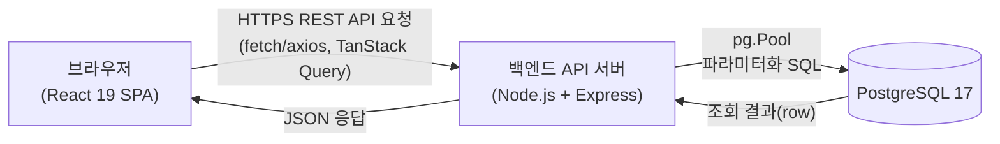
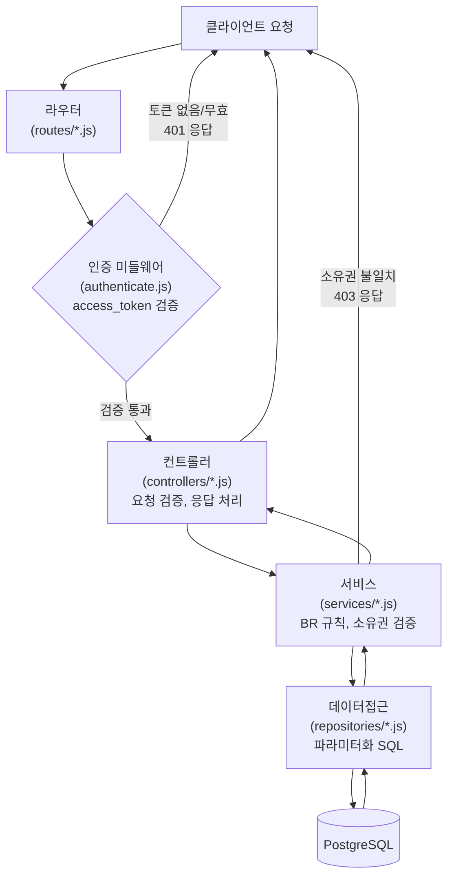
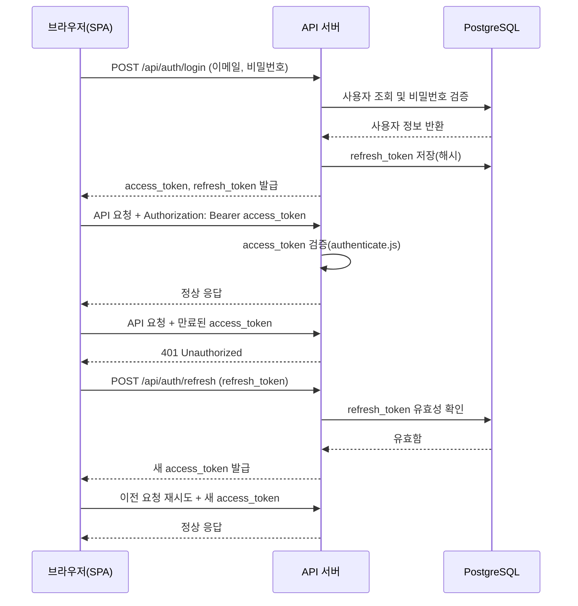

# my_Todolist 기술 아키텍처 다이어그램

## 버전 이력

| 버전 | 일자 | 작성자 | 변경 내용 |
|---|---|---|---|
| 1.0 | 2026-08-26 | gayoung.rho | 기술 아키텍처 다이어그램 최초 작성 |
| 1.1 | 2026-08-27 | gayoung.rho | 실제 프론트엔드 구현(FE-12)과의 정합성을 맞추기 위해 React Router/인증 가드(`RequireAuth`) 흐름 반영 |
| 1.2 | 2026-08-28 | gayoung.rho | 라이트/다크 모드, 다국어 기능 추가에 따라 §1에 테마/언어 상태 관리 방식(Context + localStorage, 별도 API 없음) 반영 |

## 0. 개요 및 목적

본 문서는 인증 기반 개인 할일 관리 웹앱 "my_Todolist"의 기술 아키텍처를 다이어그램으로 정리한 것이다. `docs/2-prd.md`의 기술 스택(React 19 + TypeScript + Zustand + TanStack Query, Node.js + Express + `pg`, PostgreSQL 17, JWT access_token/refresh_token)과 `docs/5-project_principle.md`의 레이어 원칙을 근거로 한다. 2일·1인 개발 규모에 맞추어 로드밸런서, 캐시 서버, 메시지 큐 등 과도한 인프라 요소는 배제하고, 실제로 채택한 최소 구성만을 표현한다.

## 목차

1. 전체 시스템 구성도
2. 백엔드 요청 처리 흐름
3. 인증(JWT) 흐름

## 1. 전체 시스템 구성도

브라우저에서 실행되는 React SPA가 단일 Express API 서버와 통신하고, API 서버는 단일 PostgreSQL 데이터베이스에 접근하는 단순한 3단 구조이다. 별도의 로드밸런서, 캐시 서버, 메시지 큐는 두지 않는다.

- 프론트엔드 상태: 서버 데이터는 TanStack Query, 클라이언트 전용 상태(로그인 정보, 필터값)는 Zustand가 관리한다. 테마(라이트/다크, FR-15)와 언어(ko/en/ja, FR-16)는 서버와 무관한 순수 클라이언트 설정이므로 별도 API 없이 React Context(`shared/config/theme`, `shared/config/i18n`)와 `localStorage`만으로 관리한다.
- 프론트엔드 라우팅: React Router(`createBrowserRouter`)가 화면 전환을 담당하며, 인증이 필요한 라우트는 `RequireAuth` 가드를 거친다. 미인증 상태로 보호된 라우트에 접근하면 로그인 화면으로 리다이렉트하고(BR-1), 로그인 성공 시 원래 요청했던 경로로 되돌아간다.
- 백엔드는 단일 프로세스의 Express 서버 하나로 구성하며, `pg.Pool`로 커넥션을 풀링해 DB에 접근한다.

## 2. 백엔드 요청 처리 흐름

API 요청은 라우터에서 인증 미들웨어를 거친 뒤 컨트롤러, 서비스, 데이터접근(repositories) 계층을 순서대로 통과해 DB에 도달한다. 각 계층의 역할은 `docs/5-project_principle.md` 2.2절과 동일하다.

- 회원가입, 로그인, 토큰 재발급 요청은 BR-1 예외 규정에 따라 인증 미들웨어를 통과하지 않고 바로 컨트롤러로 라우팅된다.
- 소유자 기반 접근 제어(BR-2)는 서비스 계층의 명시적 검증과 데이터접근 계층의 `WHERE user_id = $1` 조건으로 이중으로 적용된다.

## 3. 인증(JWT) 흐름

로그인 시 access_token(단기)과 refresh_token(장기)을 함께 발급하며, access_token 만료 시 refresh_token으로 재발급받는다. 흐름은 `docs/2-prd.md` 7.2절, `docs/5-project_principle.md` 5.2절을 근거로 한다.

- refresh_token마저 만료되었거나 무효한 경우, 서버는 401을 응답하고 프론트엔드는 로그인 화면으로 이동시킨다.
- 로그아웃 시에는 서버에 저장된 refresh_token을 무효화(삭제 또는 만료 처리)한다.
