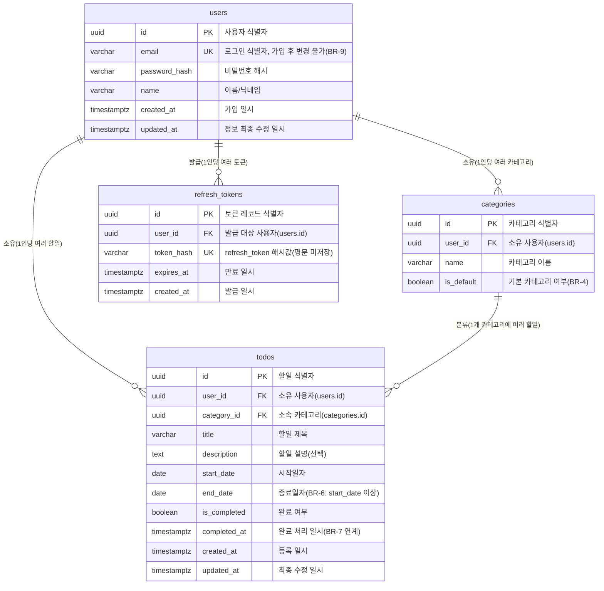

# my_Todolist ERD (Entity-Relationship Diagram)

## 버전 이력

| 버전 | 일자 | 작성자 | 변경 내용 |
|---|---|---|---|
| 1.0 | 2026-08-26 | gayoung.rho | ERD 최초 작성 |

## 1. 개요 및 목적

본 문서는 인증 기반 개인 할일 관리 웹앱 "my_Todolist"의 물리 데이터 모델(ERD)을 정의한다. `docs/1-domain_definition.md`의 엔티티(User/Category/Todo)와 비즈니스 규칙(BR-1~BR-11), `docs/2-prd.md`의 JWT 인증 방식(access_token/refresh_token), `docs/5-project_principle.md` 3.3절의 DB 테이블/컬럼 네이밍 규칙을 근거로 PostgreSQL 17 기준의 테이블 구조를 정의하는 것을 목적으로 한다.

기본키(`id`) 타입은 `docs/5-project_principle.md` 3.3절에 따라 `UUID`로 통일한다(사용자 식별자 노출에 따른 순차 추측 위험을 줄이기 위한 선택이며, 프로젝트 전체에서 일관되게 적용한다).

## 2. 목차(테이블 목록)

- [users](#41-users)
- [categories](#42-categories)
- [todos](#43-todos)
- [refresh_tokens](#44-refresh_tokens)

## 3. ERD 다이어그램

## 4. 테이블 상세

### 4.1 users

| 컬럼 | 타입 | 제약 | 설명 | 관련 BR |
|---|---|---|---|---|
| id | UUID | PK | 사용자 식별자 | - |
| email | VARCHAR | UNIQUE, NOT NULL | 로그인 식별자. 이메일 형식 준수, 가입 후 변경 불가 | BR-9 |
| password_hash | VARCHAR | NOT NULL | 비밀번호 해시(bcrypt 등). 평문 저장 금지 | - |
| name | VARCHAR(30) | NOT NULL | 사용자 이름 또는 닉네임(1자 이상 30자 이하) | BR-10 |
| created_at | TIMESTAMPTZ | NOT NULL, DEFAULT now() | 가입 일시 | - |
| updated_at | TIMESTAMPTZ | NOT NULL, DEFAULT now() | 정보 최종 수정 일시(이름·비밀번호 변경 시 갱신) | BR-10 |

- 도메인 정의서의 `password` 속성은 해시 저장 원칙(PRD NFR-03)에 따라 컬럼명을 `password_hash`로 매핑한다.
- 회원 정보 수정 시 변경 가능한 컬럼은 `name`, `password_hash`로 한정하며 `email`은 수정 대상에서 제외한다(BR-10).

### 4.2 categories

| 컬럼 | 타입 | 제약 | 설명 | 관련 BR |
|---|---|---|---|---|
| id | UUID | PK | 카테고리 식별자 | - |
| user_id | UUID | FK(→ users.id), NOT NULL | 소유 사용자. 사용자 삭제 시 함께 삭제(ON DELETE CASCADE) | BR-2 |
| name | VARCHAR(20) | NOT NULL | 카테고리 이름(1자 이상 20자 이하), 사용자 내 고유(UNIQUE(user_id, name)) | - |
| is_default | BOOLEAN | NOT NULL, DEFAULT false | '기본' 카테고리 여부. 사용자별로 정확히 1개만 true | BR-3, BR-4 |

- 사용자별 '기본' 카테고리는 항상 1개 존재해야 하며 삭제할 수 없고 이름 수정도 불가하다(BR-4). 이 규칙은 서비스 계층에서 강제하며, 데이터베이스 수준에서는 부분 유니크 인덱스(`WHERE is_default = true`)로 사용자당 기본 카테고리가 1개로 유지되도록 보조할 수 있다.
- '기본'이 아닌 카테고리 삭제 시 소속 할일은 해당 사용자의 '기본' 카테고리로 이관되며, 할일 자체는 삭제되지 않는다(BR-5). 이 로직은 트랜잭션으로 서비스 계층에서 처리하며, `categories`에는 삭제 관련 CASCADE를 두지 않는다.

### 4.3 todos

| 컬럼 | 타입 | 제약 | 설명 | 관련 BR |
|---|---|---|---|---|
| id | UUID | PK | 할일 식별자 | - |
| user_id | UUID | FK(→ users.id), NOT NULL | 소유 사용자. 사용자 삭제 시 함께 삭제(ON DELETE CASCADE) | BR-2 |
| category_id | UUID | FK(→ categories.id), NOT NULL | 소속 카테고리. 미지정 시 '기본' 카테고리로 자동 지정 | BR-3 |
| title | VARCHAR(100) | NOT NULL | 할일 제목(1자 이상 100자 이하) | - |
| description | TEXT | NULL 허용 | 할일 설명(최대 1000자) | - |
| start_date | DATE | NOT NULL | 시작일자 | - |
| end_date | DATE | NOT NULL, CHECK (end_date >= start_date) | 종료일자, 시작일자 이상이어야 함 | BR-6 |
| is_completed | BOOLEAN | NOT NULL, DEFAULT false | 완료 여부 | BR-7 |
| completed_at | TIMESTAMPTZ | NULL 허용 | 완료 처리 일시. `is_completed`가 true로 바뀔 때 현재 일시로 설정, false로 되돌리면 null로 초기화 | BR-7 |
| created_at | TIMESTAMPTZ | NOT NULL, DEFAULT now() | 등록 일시 | - |
| updated_at | TIMESTAMPTZ | NOT NULL, DEFAULT now() | 최종 수정 일시 | - |

- 할일 상태(완료/기한초과/시작 전/진행중)는 별도 컬럼으로 저장하지 않고, `start_date`, `end_date`, `is_completed`를 조회 시점에 조합해 애플리케이션(서비스 계층)에서 계산하는 파생 값이다(도메인 정의서 5장). `is_completed = true`인 할일은 종료일자 경과 여부와 무관하게 항상 '완료'로 간주한다(BR-7).
- 카테고리 삭제(BR-5)에 따른 `category_id` 재배정은 애플리케이션 트랜잭션으로 처리하므로, FK에 ON DELETE는 지정하지 않고(카테고리는 소프트하게 이관 처리되며 실질적으로 삭제되지 않는 흐름을 전제) `RESTRICT`를 기본으로 둔다.

### 4.4 refresh_tokens

| 컬럼 | 타입 | 제약 | 설명 | 관련 근거 |
|---|---|---|---|---|
| id | UUID | PK | 토큰 레코드 식별자 | - |
| user_id | UUID | FK(→ users.id), NOT NULL | 토큰 발급 대상 사용자. 사용자 삭제 시 함께 삭제(ON DELETE CASCADE) | PRD NFR-03 |
| token_hash | VARCHAR | UNIQUE, NOT NULL | refresh_token의 해시값. 평문 토큰은 저장하지 않는다 | PRD 5.2절(project_principle.md) |
| expires_at | TIMESTAMPTZ | NOT NULL | 토큰 만료 일시 | PRD FR-13 |
| created_at | TIMESTAMPTZ | NOT NULL, DEFAULT now() | 토큰 발급 일시 | - |

- 로그인(FR-02) 시 사용자별로 새 레코드를 발급하고, 로그아웃(FR-03) 시 해당 레코드를 삭제하거나 무효화하여 재사용을 차단한다.
- 토큰 재발급(FR-13)은 `token_hash`로 유효한 레코드를 조회하고 `expires_at`을 검증하여 access_token만 새로 발급하며, 이 테이블 자체는 회전(rotation) 등의 추가 정책 없이 최소 컬럼으로 구성한다(과설계 금지 원칙, project_principle.md 1절).

## 5. 관계 요약

| 관계 | 카디널리티 | 설명 | 관련 근거 |
|---|---|---|---|
| users - categories | 1 : N | 한 사용자는 여러 카테고리를 가지며, 카테고리는 반드시 한 사용자에게 소속된다 | 도메인 정의서 4장 |
| users - todos | 1 : N | 한 사용자는 여러 할일을 가지며, 할일은 반드시 한 사용자에게 소속된다 | 도메인 정의서 4장 |
| categories - todos | 1 : N | 한 카테고리는 여러 할일을 포함하며, 할일은 반드시 하나의 카테고리에 소속된다 | 도메인 정의서 4장 |
| users - refresh_tokens | 1 : N | 한 사용자는 여러 refresh_token(다중 기기 로그인 등)을 가질 수 있다 | PRD 7.2절, NFR-03 |
