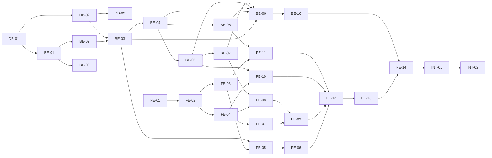

# my_Todolist 작업 실행 계획 (WBS)

## 버전 이력

| 버전 | 일자 | 작성자 | 변경 내용 |
|---|---|---|---|
| 1.0 | 2026-08-26 | gayoung.rho | 작업 실행 계획 최초 작성 |

## 0. 개요 및 목적

본 문서는 인증 기반 개인 할일 관리 웹앱 "my_Todolist"의 구체적인 작업 실행 계획(WBS)을 정의한다. `docs/1-domain_definition.md`부터 `docs/7-erd.md`, `docs/schema.sql`까지의 산출물을 근거로, 데이터베이스·백엔드·프론트엔드 단위로 관리 가능하고 독립적인 Task를 분할한다. `docs/2-prd.md`의 2일·1인 개발 일정 제약을 반영해 병행 가능한 작업과 순차적으로 진행해야 하는 작업을 구분한다.

각 Task는 수행 작업, 완료 조건(체크박스), 선행 Task를 명시하며, 관련 근거(FR/BR/화면/테이블 ID)를 함께 표기해 요구사항과의 추적성을 유지한다.

## 1. Task 요약 및 일정 배치

| 영역 | Task 수 | 1일차 | 2일차 |
|---|---|---|---|
| 데이터베이스(DB) | 3개 | DB-01, DB-02 | DB-03(여유 시) |
| 백엔드(BE) | 10개 | BE-01~BE-08 | BE-09, BE-10 |
| 프론트엔드(FE) | 14개 | FE-01~FE-06 | FE-07~FE-14 |
| 통합(INT) | 2개 | - | INT-01, INT-02 |

DB → BE 인증/할일 API → FE 화면 순으로 의존성이 이어지므로, 1일차 오전에 DB-01·DB-02를 최우선으로 끝내고 BE와 FE 초기 스캐폴딩(BE-01, FE-01)은 DB 작업과 병행한다.

## 2. 데이터베이스(DB) Task

### DB-01. PostgreSQL 환경 구성

- 수행 작업
  - 로컬(또는 개발용) PostgreSQL 17 인스턴스에 `my_todolist` 데이터베이스를 생성한다.
  - `.env`(백엔드) 및 `.env.example`에 `DATABASE_URL` 또는 `PGHOST`/`PGUSER`/`PGPASSWORD`/`PGDATABASE`/`PGPORT`를 정의한다(`docs/5-project_principle.md` 5.1절).
  - `psql` 또는 임시 스크립트로 접속 테스트를 수행한다.
- 완료 조건
  - [x] `my_todolist` 데이터베이스가 생성되어 있다.
  - [x] `.env.example`에 DB 접속 관련 키가 값 없이 정의되어 있다.
  - [x] 로컬 `.env`로 DB 접속이 성공한다(수동 확인).
- 선행 Task: 없음
- 관련 근거: `docs/5-project_principle.md` 5.1절

### DB-02. 스키마 적용

- 수행 작업
  - `docs/schema.sql`을 DB-01에서 생성한 데이터베이스에 적용한다(`psql -f docs/schema.sql` 또는 마이그레이션 스크립트 경유).
  - `docs/5-project_principle.md` 7절의 `db/migrations/` 구조를 따르는 경우, `schema.sql`의 내용을 `001_create_users_table.sql`~`004_create_refresh_tokens_table.sql`, `005_add_indexes.sql`로 분리하고 `db/migrate.js`로 순차 적용한다. 2일 일정상 시간이 부족하면 `schema.sql` 단일 파일 적용으로 대체할 수 있다(실용적 선택).
  - `users`, `categories`, `todos`, `refresh_tokens` 4개 테이블과 인덱스, 제약조건(FK, UNIQUE, CHECK)이 정상 생성되었는지 확인한다.
- 완료 조건
  - [x] 4개 테이블(`users`, `categories`, `todos`, `refresh_tokens`)이 생성되어 있다.
  - [x] `todos.end_date >= start_date` CHECK 제약(BR-6)이 존재한다.
  - [x] 사용자당 기본 카테고리 1개 제약(부분 유니크 인덱스, BR-4)이 존재한다.
  - [x] 모든 FK(`categories.user_id`, `todos.user_id`, `todos.category_id`, `refresh_tokens.user_id`)가 정상 연결되어 있다.
  - [x] `\dt`(psql) 또는 동등한 명령으로 스키마 적용 결과를 확인했다.
- 선행 Task: DB-01
- 관련 근거: `docs/7-erd.md`, `docs/schema.sql`, BR-4, BR-6

### DB-03. 로컬 개발용 시드 데이터 작성 (여유 시)

- 수행 작업
  - 테스트 계정 1~2개, 카테고리(기본 포함), 할일 샘플(시작 전/진행중/완료/기한초과 각 1건 이상)을 삽입하는 시드 스크립트(`db/seed.js` 또는 `.sql`)를 작성한다.
  - 4가지 할일 상태(도메인 정의서 5장)를 모두 눈으로 확인할 수 있도록 날짜값을 의도적으로 분산시킨다.
- 완료 조건
  - [x] 시드 스크립트 실행 시 오류 없이 데이터가 삽입된다.
  - [x] 삽입된 할일에 시작 전/진행중/완료/기한초과 상태가 각각 1건 이상 포함되어 있다.
- 선행 Task: DB-02
- 관련 근거: 도메인 정의서 5장(상태 판단 규칙)

## 3. 백엔드(BE) Task

### BE-01. 백엔드 프로젝트 스캐폴딩

- 수행 작업
  - `backend/` 디렉토리를 `docs/5-project_principle.md` 7절 구조대로 생성한다(`src/app.js`, `src/server.js`, `src/config/`, `src/routes/`, `src/controllers/`, `src/services/`, `src/repositories/`, `src/middlewares/`, `src/utils/`, `src/schemas/`, `src/db/`).
  - `package.json`에 Express, `pg`, JWT 라이브러리(`jsonwebtoken`), 비밀번호 해시 라이브러리(`bcrypt`), 요청 검증 라이브러리(선택)를 의존성으로 추가한다(Prisma 등 ORM 제외).
  - `src/config/env.js`(환경변수 파싱), `src/config/db.js`(`pg.Pool` 생성)를 작성한다.
  - `src/app.js`에서 Express 앱과 공통 미들웨어(JSON 파서, CORS)를 등록하고, `src/server.js`에서 `app.listen`으로 서버를 기동한다.
- 완료 조건
  - [ ] `npm run dev`(또는 동등 스크립트)로 서버가 오류 없이 기동된다.
  - [ ] `src/config/db.js`의 `pg.Pool`이 DB-01의 DB에 정상 연결된다.
  - [ ] 프로젝트 디렉토리 구조가 `docs/5-project_principle.md` 7절과 일치한다.
- 선행 Task: DB-01
- 관련 근거: PRD 7.2절, `docs/5-project_principle.md` 7절

### BE-02. 공통 미들웨어 및 유틸

- 수행 작업
  - `src/middlewares/errorHandler.js`(표준 에러 응답 포맷), `src/middlewares/requestLogger.js`(요청 단위 로깅), `src/middlewares/validate.js`(요청 바디 검증)를 작성한다.
  - `src/utils/ApiError.js`(상태코드+메시지를 가진 에러 클래스), `src/utils/jwt.js`(access_token/refresh_token 서명·검증 함수), `src/utils/password.js`(bcrypt 해시/검증 함수)를 작성한다.
  - `JWT_ACCESS_SECRET`, `JWT_REFRESH_SECRET`을 서로 다른 값으로 `.env`에 정의한다(`docs/5-project_principle.md` 5.2절).
- 완료 조건
  - [ ] `ApiError`를 던지면 `errorHandler`가 일관된 JSON 에러 응답(상태코드, 메시지)을 반환한다.
  - [ ] `jwt.js`의 access_token/refresh_token 발급·검증 함수가 단위 테스트 또는 수동 스크립트로 정상 동작을 확인했다.
  - [ ] `password.js`의 해시/검증 함수가 정상 동작을 확인했다.
- 선행 Task: BE-01
- 관련 근거: `docs/5-project_principle.md` 5.2절, 5.6절

### BE-03. 인증 API (회원가입/로그인/로그아웃/토큰 재발급)

- 수행 작업
  - `repositories/userRepository.js`, `repositories/refreshTokenRepository.js`(파라미터화 SQL)를 작성한다.
  - `services/authService.js`에 회원가입(이메일 중복 검사 BR-9, 비밀번호 해시), 로그인(비밀번호 검증, 실패 시 공통 오류 메시지 BR-11, access_token/refresh_token 발급), 로그아웃(refresh_token 무효화), 토큰 재발급(refresh_token 검증 후 access_token 재발급) 로직을 구현한다.
  - `controllers/authController.js`, `routes/authRoutes.js`(`POST /api/auth/signup`, `POST /api/auth/login`, `POST /api/auth/logout`, `POST /api/auth/refresh`)를 작성한다.
  - 회원가입 시 사용자별 '기본' 카테고리를 함께 생성한다(BR-3, BR-4 연계, `categoryService`와 연동).
- 완료 조건
  - [ ] 회원가입 성공 시 사용자와 '기본' 카테고리가 함께 생성된다.
  - [ ] 중복 이메일 회원가입 시도 시 적절한 오류가 반환된다(BR-9, SC-08).
  - [ ] 로그인 성공 시 access_token과 refresh_token이 함께 발급된다.
  - [ ] 로그인 실패(이메일 미존재/비밀번호 불일치) 시 동일한 오류 메시지가 반환된다(BR-11, SC-11).
  - [ ] 로그아웃 시 해당 refresh_token이 무효화되어 이후 재발급 요청이 거부된다.
  - [ ] 만료되지 않은 refresh_token으로 토큰 재발급 요청 시 새 access_token이 발급된다(FR-13).
- 선행 Task: BE-02, DB-02
- 관련 근거: FR-01, FR-02, FR-03, FR-13, BR-1, BR-9, BR-11, SC-01, SC-04, SC-08, SC-11

### BE-04. 인증 미들웨어

- 수행 작업
  - `middlewares/authenticate.js`를 작성해 `Authorization: Bearer <access_token>`을 검증하고, `req.user`에 사용자 ID를 주입한다.
  - 토큰이 없거나 유효하지 않으면 401을 반환한다(BR-1). 회원가입/로그인/토큰재발급 경로는 이 미들웨어를 적용하지 않는다.
  - 이후 모든 라우터(`todoRoutes`, `categoryRoutes`, `userRoutes`)에 이 미들웨어를 적용한다.
- 완료 조건
  - [ ] access_token 없이 보호된 API 호출 시 401이 반환된다(BR-1).
  - [ ] 만료되거나 위조된 access_token으로 호출 시 401이 반환된다.
  - [ ] 유효한 access_token으로 호출 시 `req.user`에 사용자 ID가 정상 주입된다.
- 선행 Task: BE-03
- 관련 근거: BR-1, `docs/6-arch.md` 2절

### BE-05. 회원 정보 API

- 수행 작업
  - `repositories/userRepository.js`에 사용자 정보 수정 쿼리를 추가한다.
  - `services/userService.js`, `controllers/userController.js`, `routes/userRoutes.js`(`PATCH /api/users/me`)를 작성해 이름·비밀번호만 수정 가능하도록 구현한다(이메일 수정 불가, BR-10).
- 완료 조건
  - [ ] 로그인한 사용자가 이름을 수정하면 반영된다.
  - [ ] 로그인한 사용자가 비밀번호를 수정하면 해시로 저장되고 재로그인 시 새 비밀번호로 인증된다.
  - [ ] 이메일 변경을 시도하는 요청은 무시되거나 거부된다(BR-10).
  - [ ] 인증되지 않은 요청은 401로 거부된다.
- 선행 Task: BE-04
- 관련 근거: FR-04, BR-10

### BE-06. 카테고리 API

- 수행 작업
  - `repositories/categoryRepository.js`, `services/categoryService.js`, `controllers/categoryController.js`, `routes/categoryRoutes.js`(`POST/GET/PATCH/DELETE /api/categories`, `/api/categories/:id`)를 작성한다.
  - 카테고리 등록 시 사용자 내 이름 중복을 방지하고, '기본' 카테고리는 이름 수정·삭제를 금지한다(BR-4).
  - '기본'이 아닌 카테고리 삭제 시, 소속 할일을 해당 사용자의 '기본' 카테고리로 이관하는 로직을 트랜잭션(`BEGIN`/`COMMIT`/`ROLLBACK`)으로 구현한다(BR-5).
- 완료 조건
  - [ ] 카테고리 등록/수정/삭제가 정상 동작한다.
  - [ ] '기본' 카테고리 삭제 시도는 거부된다(BR-4).
  - [ ] 일반 카테고리 삭제 시 소속 할일이 모두 '기본' 카테고리로 이관되고 할일 자체는 유실되지 않는다(BR-5, SC-02).
  - [ ] 타인의 카테고리에 대한 접근은 403으로 거부된다(BR-2).
- 선행 Task: BE-04
- 관련 근거: FR-05, FR-06, BR-2, BR-3, BR-4, BR-5, SC-02, SC-07

### BE-07. 할일 API

- 수행 작업
  - `repositories/todoRepository.js`(소유자 조건 `WHERE user_id = $1` 포함), `services/todoService.js`, `controllers/todoController.js`, `routes/todoRoutes.js`(`POST/GET/PATCH/DELETE /api/todos`, `/api/todos/:id`)를 작성한다.
  - `utils/todoStatus.js`에 `getTodoStatus(startDate, endDate, isCompleted)` 함수를 구현한다(도메인 정의서 5장 우선순위 규칙: 완료 > 기한초과 > 시작 전 > 진행중).
  - 할일 등록 시 `category_id` 미지정이면 '기본' 카테고리를 자동 지정한다(BR-3).
  - 목록 조회 API에서 카테고리·상태(시작 전/진행중/완료/기한초과) 쿼리 파라미터 기반 필터링을 지원한다(FR-09).
  - `end_date < start_date`인 요청은 검증 단계에서 거부한다(BR-6, SC-10).
  - 완료 처리/취소 API에서 `is_completed`와 `completed_at`을 함께 갱신한다(BR-7).
- 완료 조건
  - [ ] 할일 등록/수정/삭제가 정상 동작하고, 소유자 외 접근은 403으로 거부된다(BR-2, SC-09).
  - [ ] 카테고리 미지정 등록 시 '기본' 카테고리로 자동 지정된다(BR-3).
  - [ ] `end_date < start_date` 등록/수정 요청이 400으로 거부된다(BR-6, SC-10).
  - [ ] 목록 조회가 카테고리별, 시작 전/진행중/완료/기한초과 기준으로 정확히 필터링된다(FR-09).
  - [ ] 완료 처리 시 `completed_at`이 설정되고, 완료 취소 시 `null`로 초기화된다.
  - [ ] 완료된 할일은 종료일자 경과 여부와 무관하게 기한초과로 분류되지 않는다(BR-7).
- 선행 Task: BE-04, BE-06
- 관련 근거: FR-07, FR-08, FR-09, FR-10, FR-11, FR-12, BR-2, BR-3, BR-6, BR-7, BR-8, SC-01, SC-03, SC-05, SC-09, SC-10

### BE-08. 헬스 체크 엔드포인트

- 수행 작업
  - `routes/healthRoutes.js`(`GET /api/health`)를 작성해 서버 및 DB 커넥션 풀 상태를 반환한다.
- 완료 조건
  - [ ] `GET /api/health` 호출 시 200과 함께 DB 연결 상태가 반환된다.
- 선행 Task: BE-01
- 관련 근거: `docs/5-project_principle.md` 5.7절

### BE-09. 백엔드 핵심 로직 단위 테스트

- 수행 작업
  - `docs/5-project_principle.md` 4장 "필수" 항목을 기준으로 단위 테스트를 작성한다: 할일 상태 판단(`getTodoStatus`), 소유권 검증(BR-2), 날짜 유효성 검증(BR-6), 기본 카테고리 처리(BR-3~BR-5), JWT 인증/인가 미들웨어(BR-1).
  - Node.js 기본 테스트 러너(`node:test`) 또는 경량 프레임워크를 사용한다.
- 완료 조건
  - [ ] `getTodoStatus`의 4가지 상태 분기(완료/기한초과/시작 전/진행중)가 모두 테스트로 검증된다.
  - [ ] 소유권 불일치 시 403을 반환하는 로직이 테스트로 검증된다.
  - [ ] `end_date < start_date` 거부 로직이 테스트로 검증된다.
  - [ ] 기본 카테고리 자동 지정 및 삭제 시 이관 로직이 테스트로 검증된다.
  - [ ] 인증 미들웨어의 401 처리가 테스트로 검증된다.
  - [ ] 모든 테스트가 `npm test`(또는 동등 명령)로 통과한다.
- 선행 Task: BE-03, BE-04, BE-05, BE-06, BE-07
- 관련 근거: `docs/5-project_principle.md` 4장

### BE-10. 백엔드 통합 점검

- 수행 작업
  - `docs/3-user_scenario.md`의 SC-01(End-to-End 시나리오)을 Postman, curl, 또는 동등 도구로 API 레벨에서 수동 재현한다.
  - SC-08(중복 이메일), SC-09(타인 리소스 접근), SC-10(날짜 역전), SC-11(로그인 실패)의 예외 흐름도 함께 점검한다.
- 완료 조건
  - [ ] SC-01 전체 흐름(회원가입→로그인→카테고리 생성→할일 등록→목록 필터링→수정→완료 처리→로그아웃)이 API 레벨에서 오류 없이 재현된다.
  - [ ] SC-08, SC-09, SC-10, SC-11의 예외 응답이 기대한 상태 코드·메시지와 일치한다.
- 선행 Task: BE-09
- 관련 근거: `docs/3-user_scenario.md` SC-01, SC-08~SC-11

## 4. 프론트엔드(FE) Task

### FE-01. 프론트엔드 프로젝트 스캐폴딩

- 수행 작업
  - Vite 기반 React 19 + TypeScript 프로젝트를 생성하고, Zustand·TanStack Query·라우팅 라이브러리(예: React Router)를 의존성에 추가한다.
  - `docs/5-project_principle.md` 6절의 FSD 디렉토리 구조(`app/`, `pages/`, `widgets/`, `features/`, `entities/`, `shared/`)를 생성한다.
  - `.env.example`에 백엔드 API 베이스 URL을 정의한다.
- 완료 조건
  - [ ] `npm run dev`로 개발 서버가 정상 기동되고 빈 화면이 렌더링된다.
  - [ ] FSD 6개 레이어 디렉토리가 모두 생성되어 있다.
  - [ ] TypeScript, ESLint(선택) 설정이 오류 없이 동작한다.
- 선행 Task: 없음(BE 작업과 병행 가능)
- 관련 근거: `docs/5-project_principle.md` 6절

### FE-02. shared 레이어 구축

- 수행 작업
  - `shared/api/client.ts`에 API 클라이언트 인스턴스를 구성하고, access_token 첨부 및 401 발생 시 refresh_token 재발급 인터셉터를 구현한다(`docs/6-arch.md` 3절 흐름 반영).
  - `shared/ui/`에 `Button`, `ConfirmDialog`, `ErrorMessage`, `DateRangePicker`(캘린더 UI) 컴포넌트를 구현한다.
  - `shared/lib/validators.ts`(이메일 형식, 비밀번호 규칙 등), `shared/config/env.ts`를 작성한다.
- 완료 조건
  - [ ] API 클라이언트가 요청에 access_token을 자동으로 첨부한다.
  - [ ] 401 응답 발생 시 refresh_token으로 자동 재시도되고, 재발급도 실패하면 로그인 페이지로 이동한다(SC-04).
  - [ ] `DateRangePicker`로 시작일·종료일을 선택할 수 있다.
  - [ ] 공용 UI 컴포넌트가 데스크톱/모바일 뷰포트에서 깨지지 않는다.
- 선행 Task: FE-01
- 관련 근거: FR-04(캘린더), NFR-02, SC-04, `docs/6-arch.md` 3절

### FE-03. entities/user 구현

- 수행 작업
  - `entities/user/model/types.ts`(User, LoginRequest, LoginResponse 등), `entities/user/model/useAuthStore.ts`(Zustand: 로그인 여부, 사용자 정보, access_token), `entities/user/api/userApi.ts`를 작성한다.
- 완료 조건
  - [ ] `useAuthStore`로 로그인 상태를 전역에서 조회·갱신할 수 있다.
  - [ ] `userApi`가 BE-05 API와 연동해 정상 응답을 받는다.
- 선행 Task: FE-02
- 관련 근거: `docs/5-project_principle.md` 2.1절, FR-04

### FE-04. entities/category, entities/todo 구현

- 수행 작업
  - `entities/category/`: 타입, `categoryApi.ts`, `useCategoriesQuery.ts`를 작성한다.
  - `entities/todo/`: 타입, `todoApi.ts`, `useTodosQuery.ts`(필터 파라미터 포함), `getTodoStatus.ts`(도메인 정의서 5장 로직을 프론트엔드에서도 동일하게 구현, 서버 응답의 `startDate/endDate/isCompleted` 기반 표시용), `TodoListItem.tsx`, `TodoStatusBadge.tsx`(4가지 상태 배지)를 작성한다.
- 완료 조건
  - [ ] `useCategoriesQuery`, `useTodosQuery`가 각각 BE-06, BE-07 API와 연동해 목록을 조회한다.
  - [ ] `getTodoStatus`가 4가지 상태를 정확히 계산하며, 백엔드 로직(BE-07의 `todoStatus.js`)과 동일한 결과를 낸다.
  - [ ] `TodoStatusBadge`가 상태별로 시각적으로 구분된다(4-wireframe.md 색상/배지 규칙 반영).
- 선행 Task: FE-02
- 관련 근거: 도메인 정의서 5장, FR-08, FR-09, `docs/4-wireframe.md` W-03

### FE-05. features/auth-signup, auth-login, auth-logout 구현

- 수행 작업
  - `features/auth-signup/`, `features/auth-login/`(폼 UI + `useMutation` 훅), `features/auth-logout/`(로그아웃 훅)을 작성한다.
  - 로그인 성공 시 `entities/user`의 `useAuthStore`를 갱신하고 토큰을 저장한다.
- 완료 조건
  - [ ] 회원가입 폼 제출 시 BE-03 API 호출 후 성공/실패 피드백이 표시된다.
  - [ ] 중복 이메일 가입 시도 시 오류 메시지가 화면에 표시된다(SC-08).
  - [ ] 로그인 성공 시 `useAuthStore`에 사용자 정보와 토큰이 반영된다.
  - [ ] 로그인 실패 시 이메일 미존재/비밀번호 불일치를 구분하지 않는 동일한 오류 메시지가 표시된다(BR-11, SC-11).
  - [ ] 로그아웃 클릭 시 세션이 종료되고 로그인 화면으로 이동한다.
- 선행 Task: FE-03, BE-03
- 관련 근거: FR-01, FR-02, FR-03, SC-01, SC-08, SC-11

### FE-06. 회원가입/로그인 페이지 구현

- 수행 작업
  - `pages/signup/ui/SignupPage.tsx`(W-01), `pages/login/ui/LoginPage.tsx`(W-02)를 작성해 FE-05의 feature를 배치한다.
  - `docs/4-wireframe.md`의 데스크톱/모바일 레이아웃을 반영한다.
- 완료 조건
  - [ ] 회원가입 화면에서 이메일/비밀번호/이름 입력 후 가입이 완료된다.
  - [ ] 로그인 화면에서 이메일/비밀번호 입력 후 로그인이 완료되고 할일 목록 화면으로 이동한다.
  - [ ] 데스크톱·모바일 뷰포트 모두에서 레이아웃이 깨지지 않는다(NFR-02).
- 선행 Task: FE-05
- 관련 근거: `docs/4-wireframe.md` W-01, W-02

### FE-07. 공통 헤더 및 할일 필터 위젯

- 수행 작업
  - `widgets/app-header/ui/AppHeader.tsx`(공통 내비게이션, 로그아웃 포함)를 작성한다.
  - `features/todo-filter/model/useTodoFilterStore.ts`(Zustand: 선택된 카테고리/상태 필터값), `widgets/todo-filter-bar/ui/TodoFilterBar.tsx`를 작성한다.
- 완료 조건
  - [ ] `AppHeader`가 모든 페이지 상단에 공통으로 노출되고, 로그아웃 버튼이 정상 동작한다.
  - [ ] `TodoFilterBar`에서 카테고리 및 상태(시작 전/진행중/완료/기한초과)를 선택하면 필터 상태가 갱신된다.
- 선행 Task: FE-04
- 관련 근거: FR-03, FR-09, `docs/4-wireframe.md` 공통 내비게이션, W-03

### FE-08. 할일 등록/수정/삭제/완료 처리 기능 구현

- 수행 작업
  - `features/todo-create/`(폼 + 캘린더 입력 포함), `features/todo-edit/`, `features/todo-delete/`, `features/todo-toggle-complete/`을 작성한다.
  - 클라이언트 측에서도 `end_date < start_date` 입력을 차단하거나 경고한다(BR-6, 서버 검증과 이중 방어).
- 완료 조건
  - [ ] 할일 등록 폼에서 캘린더로 시작일·종료일을 선택해 등록할 수 있다(FR-07).
  - [ ] 종료일자를 시작일자보다 이르게 설정하면 등록 전 오류가 표시된다(SC-10).
  - [ ] 할일 수정, 삭제, 완료 처리/취소가 각각 정상 동작하고 목록에 즉시 반영된다(TanStack Query 캐시 무효화 확인).
- 선행 Task: FE-04, BE-07
- 관련 근거: FR-07, FR-10, FR-11, FR-12, BR-6, SC-05, SC-10

### FE-09. 할일 목록/등록·수정 페이지 구현

- 수행 작업
  - `pages/todo-list/ui/TodoListPage.tsx`(W-03: `TodoFilterBar` + 할일 목록 배치), `pages/todo-form/ui/TodoFormPage.tsx`(W-04: 등록/수정 공통)를 작성한다.
- 완료 조건
  - [ ] 할일 목록 화면에서 필터를 적용하면 목록이 즉시 갱신된다.
  - [ ] 목록의 각 항목에 상태 배지가 올바르게 표시된다.
  - [ ] 목록에서 항목 클릭 시 수정 화면으로 이동하고, 기존 값이 폼에 채워진다.
  - [ ] 데스크톱·모바일 뷰포트 모두에서 레이아웃이 와이어프레임과 일치한다.
- 선행 Task: FE-07, FE-08
- 관련 근거: `docs/4-wireframe.md` W-03, W-04, SC-01, SC-03

### FE-10. 카테고리 관리 기능 및 페이지 구현

- 수행 작업
  - `features/category-manage/`(등록/수정/삭제 폼 및 훅), `pages/category-manage/ui/CategoryManagePage.tsx`(W-05)를 작성한다.
- 완료 조건
  - [ ] 카테고리 등록/수정/삭제가 화면에서 정상 동작한다.
  - [ ] '기본' 카테고리는 수정·삭제 버튼이 비활성화되거나 시도 시 안내 메시지가 표시된다(BR-4).
  - [ ] 카테고리 삭제 시 소속 할일이 '기본' 카테고리로 이관된 결과가 목록 화면에서 확인된다(SC-02).
- 선행 Task: FE-04, BE-06
- 관련 근거: FR-05, FR-06, BR-4, BR-5, SC-02, SC-07, `docs/4-wireframe.md` W-05

### FE-11. 회원 정보 수정 기능 및 페이지 구현

- 수행 작업
  - `features/profile-edit/`, `pages/profile/ui/ProfilePage.tsx`(W-06)를 작성한다.
- 완료 조건
  - [ ] 이름·비밀번호 수정이 화면에서 정상 동작한다.
  - [ ] 이메일 입력 필드는 읽기 전용으로 표시되어 수정할 수 없다(BR-10).
- 선행 Task: FE-03, BE-05
- 관련 근거: FR-04, BR-10, `docs/4-wireframe.md` W-06

### FE-12. 라우팅 및 인증 가드 연결

- 수행 작업
  - `app/routes/router.tsx`에서 전체 페이지(FE-06, FE-09, FE-10, FE-11)를 라우트로 연결한다.
  - 인증이 필요한 라우트에 가드를 적용해, 미인증 상태로 접근 시 로그인 페이지로 리다이렉트한다.
- 완료 조건
  - [ ] 미로그인 상태에서 보호된 경로 접근 시 로그인 페이지로 이동한다.
  - [ ] 로그인 후 원래 요청한 페이지 또는 할일 목록 페이지로 정상 이동한다.
  - [ ] 모든 페이지가 라우트에 정상 연결되어 새로고침 시에도 접근 가능하다.
- 선행 Task: FE-06, FE-09, FE-10, FE-11
- 관련 근거: BR-1, `docs/6-arch.md` 1절

### FE-13. 반응형 레이아웃 최종 점검

- 수행 작업
  - 모든 페이지를 데스크톱(1024px 이상)과 모바일(375~767px) 뷰포트에서 `docs/4-wireframe.md`와 대조 점검한다.
  - 레이아웃 깨짐, 터치 영역 부족, 가로 스크롤 발생 등을 수정한다.
- 완료 조건
  - [ ] 전체 화면(W-01~W-06, 공통 헤더)이 데스크톱·모바일 뷰포트 모두에서 와이어프레임과 일치한다(NFR-02).
  - [ ] 의도하지 않은 가로 스크롤이 없다.
- 선행 Task: FE-12
- 관련 근거: NFR-02, `docs/4-wireframe.md`

### FE-14. 프론트엔드 E2E 수동 시나리오 검증

- 수행 작업
  - `docs/3-user_scenario.md`의 SC-01(End-to-End)을 실제 브라우저에서 처음부터 끝까지 수행한다.
  - SC-02~SC-11의 보조·예외 시나리오를 화면에서 재현해 기대 결과와 비교한다.
- 완료 조건
  - [ ] SC-01(회원가입→로그인→카테고리 생성→할일 등록→필터링→수정→완료 처리→로그아웃)이 화면에서 오류 없이 완료된다.
  - [ ] SC-02~SC-11이 각각 문서에 기술된 기대 결과와 일치한다.
- 선행 Task: FE-13, BE-10
- 관련 근거: `docs/3-user_scenario.md` SC-01~SC-11

## 5. 통합(INT) Task

### INT-01. 프론트엔드-백엔드 통합 스모크 테스트

- 수행 작업
  - 프론트엔드 개발 서버와 백엔드 서버를 동시에 기동하고 `CORS_ORIGIN`을 프론트엔드 개발 서버 주소로 설정한다.
  - 실제 브라우저에서 API 통신이 정상 이루어지는지 확인한다(CORS 오류, 401 재발급 흐름 포함).
- 완료 조건
  - [ ] 브라우저 콘솔에 CORS 관련 오류가 없다.
  - [ ] access_token 만료 시나리오에서 자동 재발급이 브라우저에서도 정상 동작한다(SC-04).
- 선행 Task: FE-14
- 관련 근거: `docs/5-project_principle.md` 5.4절, SC-04

### INT-02. 배포 전 최종 점검

- 수행 작업
  - `docs/5-project_principle.md` 4장의 "배포 전 최소 기준"(필수 테스트 통과 + SC-01 수동 재현)을 최종 확인한다.
  - 환경변수(`.env.example`) 목록이 실제 사용 중인 키와 일치하는지 재확인한다.
- 완료 조건
  - [ ] BE-09의 모든 "필수" 단위 테스트가 통과한다.
  - [ ] SC-01이 최종 빌드(또는 최종 코드 상태)에서 재현된다.
  - [ ] `.env.example`에 실제 사용하는 모든 환경변수 키가 값 없이 기재되어 있다.
- 선행 Task: INT-01
- 관련 근거: `docs/5-project_principle.md` 4장

## 6. Task 의존 관계 요약

